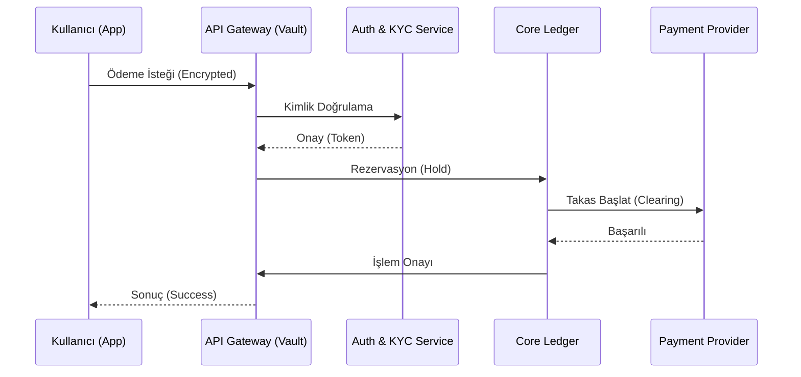

# 🏦 Fin-Arch-TR: Finansal Teknolojiler Sistem Mimarisi Rehberi

## 🛡️ Stratejik Finansal Operasyon Merkezi
**Fin-Arch-TR**, TEKNOFEST 2025 Finansal Teknolojiler kategorisi için tasarlanmış, endüstriyel standartlarda bir sistem mimarisi rehberidir. Bu depo, basit bir kod yığınından ziyade, modern bir "Fintech IT Architect"in oyun alanıdır.

---

## 🏛️ Mimari Katmanlar (Architectural Layers)

### 1. İşlem ve Mutabakat Motoru (Core Ledger & Settlement)
Finansal sistemin kalbi, ACID prensiplerine tam uyumlu bir mutabakat motorudur.
*   **Double-Entry Bookkeeping:** Her işlemin simetrik kaydı.
*   **Event Sourcing:** Tüm bakiye değişimlerinin immutable (değiştirilemez) bir log üzerinden tutulması.
*   **Idempotency:** Ağ hatalarında mükerrer ödemeleri önleyen benzersiz işlem kimlikleri.

### 2. BaaS & Açık Bankacılık (Open Banking Ecosystem)
API-First yaklaşımı ile bankacılık servislerini birer modül haline getirme stratejisi.
*   **ISO 20022:** Uluslararası finansal mesajlaşma standartları.
*   **Dynamic Routing:** Ödemeleri en düşük komisyonlu veya en hızlı kanala yönlendirme motoru.

### 3. Güvenlik ve Uyumluluk (Cyber-Fin Security)
Finansal verinin dokunulmazlığı için "Zero Trust" mimarisi.
*   **PCI-DSS Level 1:** Kart hamili verilerinin güvenli yönetimi. [Detaylar →](docs/COMPLIANCE.md)
*   **HSM Integration:** Donanımsal güvenlik modülleri ile anahtar yönetimi.
*   **AML/KYC Engine:** Kara para aklamayı önleme ve "Müşterini Tanı" algoritmaları.

### 4. Geliştirici Araçları & Altyapı
*   **Core Logic:** [ledger.py](src/core/ledger.py) - Finansal dürüstlük simülatörü.
*   **Infra Stack:** [docker-compose.yml](src/infra/docker-compose.yml) - FinTech altyapısı.
*   **API Design:** [API_DESIGN.md](docs/API_DESIGN.md) - Finansal servis standartları.

---

---

## 📊 Operasyonel Akış (System Flow)

---

## 🚀 Yol Haritası (Roadmap)
- [x] Mimari Katmanların Belirlenmesi
- [x] Çift Kayıtlı (Double-Entry) Muhasebe Motoru
- [x] Docker Altyapı Şablonları (Postgres, Kafka, Redis)
- [x] Detaylı Uyumluluk (PCI-DSS, KVKK) Dokümantasyonu
- [x] API Tasarım Standartları (REST & gRPC)
- [x] Kafka tabanlı Event-Sourcing Uygulaması
- [x] Kubernetes Deployment Manifests
- [x] AML/KYC Validation Engine
- [x] Private Blockchain Simulation (PoW)
- [x] Interactive CLI Command Center
- [x] CI/CD Pipelines (GitHub Actions)

© 2025 Fin-Arch-TR - Elite Command Center Principles Apply.

  

